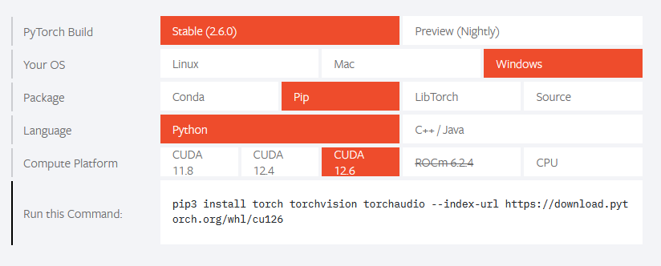
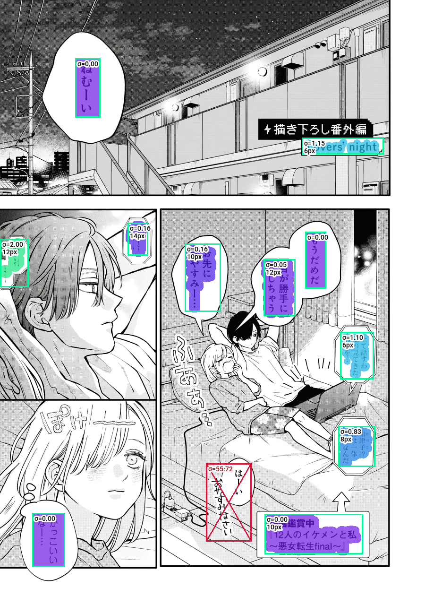

# 🎇 Manga Translator
Manga Translator - an app that allows you to translate, clean, read with OCR manga pages easily! You can edit manga pages in programm directly!

# 🛠️ Installation
The installation is pretty simple! Prefered _python_ version: 3.12. You can download it from python [webpage](https://python.org/downloads)
```bash
git clone https://github.com/PoweredDeveloper/Manga-Translator
```
```bash
pip install -r ./requirements.txt
```

Please, install PyTorch using this this link: [PyTorch Install](https://pytorch.org/)
<br />
!! If it doesn't work, please try to change `pip3` to `pip` !!



And now you are ready to go! Run `main.py` and that's it!
```bash
python ./main.py
```

# 🖼️ Example of app output

<br />
<sup>山田くんとLv999の恋をする ©Mashiro</sup>


<br />
<sup>山田くんとLv999の恋をする ©Mashiro</sup>


<br />
<sup>山田くんとLv999の恋をする ©Mashiro</sup>


<br />
<sup>山田くんとLv999の恋をする ©Mashiro</sup>


<br />
<sup>山田くんとLv999の恋をする ©Mashiro</sup>

# 📚 Acknowledgements
[Comic Text Detector](https://github.com/dmMaze/comic-text-detector)<br />
[manga-ocr](https://github.com/kha-white/manga-ocr)